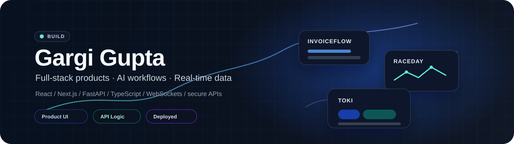

  

I build deployed full-stack products around AI workflows, data-heavy interfaces, and usable automation.

Currently building **Toki**, an AI-assisted productivity workspace for sessions, context, tasks, and follow-up actions.

---

## Work

| Project | What it does | Links |
| --- | --- | --- |
| **InvoiceFlow AI** | Finance workflow automation for invoice review, policy evidence, human review, and audit trails. | [Live](https://invoiceflow-ai-a9yq.onrender.com/ui) · [Repo](https://github.com/GargiGupta-io/invoiceflow-ai) |
| **RaceDay** | Formula 1 companion for race stories, strategy views, simulations, and live race data. | [Live](https://raceday-khaki.vercel.app) · [Repo](https://github.com/GargiGupta-io/raceday) |

## Toolkit

**Frontend:** `React` · `Next.js` · `TypeScript` · `Tailwind CSS`  
**Backend:** `Python` · `FastAPI` · `Node.js` · `REST APIs` · `WebSockets`  
**Quality:** `Pytest` · `GitHub Actions` · `API checks` · `secure coding`  
**Deploy:** `Render` · `Vercel` · `Railway` · `Docker`
